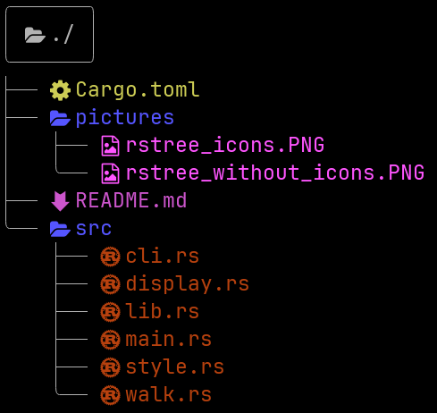

<p align="center">
  
  
  
</p>

<h1 align="center">🌳 rstree</h1>

<p align="center">
  <i>A colorful directory tree visualizer for the terminal — written in Rust.</i>
</p>

<p align="center">
  <code>rstree [OPTIONS] [PATH]</code>
</p>

---

## ✨ Features at a Glance

| | Feature | What it does |
|---|---|---|
| 🌿 | **Tree view** | Recursive directory traversal with Unicode box-drawing connectors |
| 🎨 | **Nerd Font icons** | 100+ file extension mappings with colored glyphs |
| 🙈 | **`.gitignore` aware** | Respects `.gitignore` rules via the `ignore` crate (ripgrep) |
| 📋 | **Long format** | File permissions, size, and modification date (`-l`) |
| 👻 | **Hidden files** | Toggle visibility with `-a` / `--all` |
| 📏 | **Max depth** | Limit recursion depth with `-L` / `--max-depth` |
| 🔄 | **Reverse sort** | Reverse file order with `-r` / `--rev` |
| 🔗 | **Symlink safety** | Loop detection via canonicalized paths |
| 🖥️ | **Cross-platform** | Windows attributes and Unix `rwx` permissions |
| ⏱️ | **Performance stats** | Elapsed time, directory count, and file count on exit |

---

## ⚠️ Requirements

> **A [Nerd Font](https://www.nerdfonts.com/) must be installed and set as your terminal font.**
>
> Without one, the icons will not render correctly. Recommended: [JetBrainsMono Nerd Font](https://www.nerdfonts.com/font-downloads).

---

## 📦 Installation

```bash
# Clone and install
git clone https://github.com/yourusername/rstree.git
cd rstree
cargo install --path .
```

```bash
# Or build a release binary manually
cargo build --release
cp target/release/rstree ~/.local/bin/
```

---

## 🚀 Usage

```
rstree [OPTIONS] [PATH]
```

| Argument | Description |
|---|---|
| `PATH` | Directory to display _(default: current directory)_ |

### Options

| Flag | Short | Description |
|---|---|---|
| `--files` | `-f` | Show files _(by default only directories are shown)_ |
| `--all` | `-a` | Show hidden files and directories |
| `--rev` | `-r` | Reverse sort order |
| `--long` | `-l` | Long listing with permissions, size, and date |
| `--max-depth <N>` | `-L` | Limit display depth to `N` levels |
| `--version` | `-v` | Print version information |
| `--help` | `-h` | Print help information |

### Examples

```bash
# Show current directory tree
rstree

# Show files with long format
rstree -fl

# Show all files (including hidden), max depth 3
rstree -aL 3 /path/to/project
```

---

## 🖼️ Preview

| Without icons | With Nerd Font |
|---|---|
|  |  |

---

## 🧱 Tech Stack

| Component | Crate |
|---|---|
| CLI parsing | [`clap`](https://crates.io/crates/clap) 4 (derive) |
| Terminal colors | [`colored`](https://crates.io/crates/colored) 2 |
| Gitignore matching | [`ignore`](https://crates.io/crates/ignore) 0.4 |
| Date/time formatting | [`chrono`](https://crates.io/crates/chrono) 0.4 |
| Unicode width | [`unicode-width`](https://crates.io/crates/unicode-width) 0.2 |
| Extension → style maps | [`phf`](https://crates.io/crates/phf) 0.11 (compile-time perfect hashing) |
| ANSI stripping | [`strip-ansi-escapes`](https://crates.io/crates/strip-ansi-escapes) 0.2 |

---

## 📄 License

```
MIT License

Copyright (c) 2025 rstree

Permission is hereby granted, free of charge, to any person obtaining a copy
of this software and associated documentation files (the "Software"), to deal
in the Software without restriction, including without limitation the rights
to use, copy, modify, merge, publish, distribute, sublicense, and/or sell
copies of the Software, and to permit persons to whom the Software is
furnished to do so, subject to the following conditions:

The above copyright notice and this permission notice shall be included in all
copies or substantial portions of the Software.

THE SOFTWARE IS PROVIDED "AS IS", WITHOUT WARRANTY OF ANY KIND, EXPRESS OR
IMPLIED, INCLUDING BUT NOT LIMITED TO THE WARRANTIES OF MERCHANTABILITY,
FITNESS FOR A PARTICULAR PURPOSE AND NONINFRINGEMENT. IN NO EVENT SHALL THE
AUTHORS OR COPYRIGHT HOLDERS BE LIABLE FOR ANY CLAIM, DAMAGES OR OTHER
LIABILITY, WHETHER IN AN ACTION OF CONTRACT, TORT OR OTHERWISE, ARISING FROM,
OUT OF OR IN CONNECTION WITH THE SOFTWARE OR THE USE OR OTHER DEALINGS IN THE
SOFTWARE.
```

---

<p align="center">
  <sub>🤖 This project and its code were generated with AI assistance</sub>
</p>
